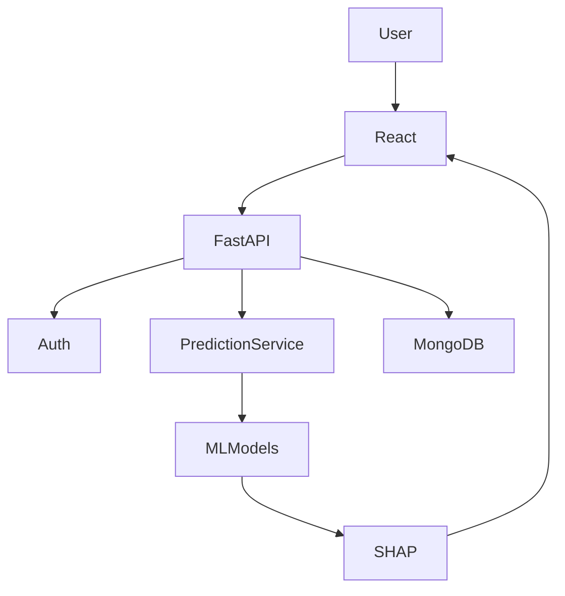

# Explainable AI-Based Multi-Disease Prediction & Healthcare Decision Support System

## Problem Statement
The integration of Machine Learning into healthcare requires transparent, explainable decisions. This project offers a comprehensive decision-support tool capable of predicting the risk of multiple diseases (Diabetes, Heart Disease, Liver Disease, and Kidney Disease) while providing SHAP-based feature explanations to aid clinical understanding.

## Features
- **Multi-Disease Prediction**: Predicts risks for Diabetes, Heart Disease, Liver Disease, and Kidney Disease using state-of-the-art ML models.
- **Explainable AI (XAI)**: Utilizes SHAP (SHapley Additive exPlanations) to explain individual predictions transparently.
- **Modern Full-Stack Architecture**: React (Frontend), FastAPI (Backend), and MongoDB (Database).
- **Secure Authentication**: JWT-based secure user authentication and registration.
- **Docker Ready**: Fully containerized backend, frontend, and database services via Docker Compose.

## Architecture



## Technology Stack
- **Frontend**: React.js, Tailwind CSS, Recharts, Vite
- **Backend**: Python, FastAPI, Pydantic, Passlib, JWT
- **Machine Learning**: Scikit-learn, XGBoost, Pandas, Numpy, SHAP
- **Database**: MongoDB
- **Deployment**: Docker, Docker Compose

## Machine Learning Methodology
Models were trained using open-source datasets (Pima Indians Diabetes, UCI Heart Disease, Indian Liver Patient Dataset, Chronic Kidney Disease). 
- **Preprocessing**: SimpleImputer and StandardScaler for numerical features; OneHotEncoder for categorical features.
- **Model**: XGBoost Classifiers.
- **Evaluation**: Accuracy, Precision, Recall, F1-Score, and ROC-AUC metrics via Cross-Validation. Models were tuned with `GridSearchCV`.
- **Explainability**: SHAP's `TreeExplainer` breaks down the contribution of each feature per prediction.

## API Documentation
Once the backend is running, the interactive API documentation (Swagger UI) is available at: `http://localhost:8000/docs`.

## Environment Variables
Create a `.env` file in the `backend/` and `frontend/` directory (see `.env.example` in each folder).
```
MONGODB_URI=mongodb://localhost:27017
JWT_SECRET=super_secret_key_change_in_production
```

## Running Locally (Docker)

To run the complete application using Docker:

```bash
docker-compose up --build
```
- **Frontend**: `http://localhost:5173`
- **Backend**: `http://localhost:8000`

## Running Locally (Without Docker)

### Backend
```bash
python -m venv venv
source venv/bin/activate  # On Windows: .\venv\Scripts\Activate.ps1
pip install -r requirements.txt
cd backend
uvicorn app.main:app --reload
```

### Frontend
```bash
cd frontend
npm install
npm run dev
```

## Disclaimer
> **This system is intended for educational and decision-support purposes only and is not a substitute for professional medical diagnosis or treatment.**
